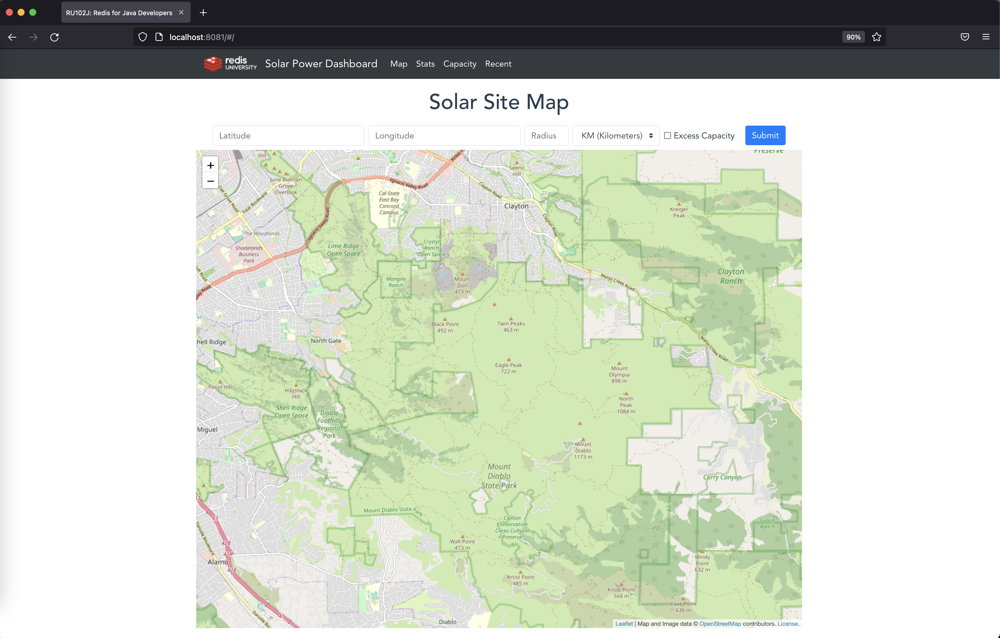

# RediSolar for Java

Introduction
---



This is the sample application codebase for RU102J, [Redis for Java Developers](https://university.redis.com/courses/ru102j/) at [Redis University](https://university.redis.com).

Solutions to the course programming challenges can be found on the `solutions` branch.

Prerequisites
---

In order to start and run this application, you will need:

* Java 8 JDK or higher
* [Maven](https://maven.apache.org/)
* Access to a local or remote installation of [Redis Stack](https://redis.io/docs/stack/get-started/install/) (local preferred, Docker is a good option - see instructions below)
* Optional: [Docker](https://www.docker.com/get-started/)
* Optional but recommended: [RedisInsight](https://redis.com/redis-enterprise/redis-insight/) to visualize the data in Redis.  This is a graphical alternative to the `redis-cli` command

Running Redis Stack with Docker
---

We've provided a Docker Compose file as part of this repo, so to start Redis Stack, use the following command:

```bash
docker compose up -d
```

*Note:* in environments using older versions of Docker Compose (v1.x), use the ```docker-compose up -d``` command instead.

This will start a Redis Stack container with Redis exposed on localhost port 6379 with no password.  You should see output similar to the following:

```
Creating network "ru102j_default" with the default driver
Creating redis_ru102j ... done
```

Connect to Redis using either RedisInsight, or the `redis-cli` command.  When using `redis-cli` you can invoke it from the Docker container like this:

```bash
docker exec -it redis_ru102j redis-cli
```

When you see this prompt:

```
127.0.0.1:6379>
```

you are connected to Redis.  Type `quit` to exit the Redis CLI.

When you are finished working with Redis, shut down the server like so:

```bash
docker compose down
```

Redis saves your data in an append only file in the `redisdata` folder, and will re-load it next time you start the container.

How to Start the RediSolar Application
---

### When using Redis on localhost, port 6379 with no password:

1. Run `mvn package` to build your application.
2. Load the sample data: `java -jar target/redisolar-1.0.jar load`.  If you want to erase everything in Redis before loading the data, use `java -jar target/redisolar-1.0.jar load --flush true`, but be aware that this will delete ALL keys in your Redis database.  Note that loading the data may take a few minutes.
3. Start the application with `java -jar target/redisolar-1.0.jar server config.yml`
4. To check that your application is running enter url `http://localhost:8081`, substituting `localhost` for the hostname that you're running the application on if necessary.

### When using Redis on another host, port or with a password:

1. Edit `config.yml`, setting the values for your Redis host, port and password if needed.
2. Edit `src/test/java/com/redislabs/university/RU102J/HostPort.java`, setting the values for your Redis host, port, and password if needed.
3. Run `mvn package` to build your application.
4. Load the sample data with `java -jar target/redisolar-1.0.jar load --host <hostname> --port <port> --password <password>`.
5. Start application with `java -jar target/redisolar-1.0.jar server config.yml`.
6. To check that your application is running enter url `http://localhost:8081`, substituting `localhost` for the hostname that you're running the application on if necessary.

Tests
---

To run all tests:

```
mvn test
```

To run a specific test:

```
mvn test -Dtest=JedisBasicsTest
```

Building
---

To rebuild the application:

```
mvn package
```

To rebuild the application without running the tests:

```
mvn package -DskipTests 
```

Optional (but Recommended): RedisInsight
---

RedisInsight is a graphical tool for viewing data in Redis and managing Redis server instances.  You don't need to install it to be successful with this course, but we recommend it as a good way of viewing data stored in Redis.

To use RedisInsight, you'll need to [download it](https://redis.io/docs/ui/insight/) then point it at your Redis instance.

If you're using the Docker Compose file provided with this course to run Redis Stack, you can optionally choose to access a web-based version of Redis Stack at `http://localhost:8001` whenever the container is running.

Need Help / Join our Community
---

If you need help with the course or want to chat to your fellow students and the wider Redis community, please [join us on our Discord server](https://discord.gg/jucCB8h).

Subscribe to our YouTube Channel / Follow us on Twitch
---

We'd love for you to [check out our YouTube channel](https://youtube.com/redisinc), and subscribe if you want to see more Redis videos!  We also stream regularly on our [Twitch.tv channel](https://www.twitch.tv/redisinc) - follow us to be notified when we're live or check out our [streaming schedule](https://developer.redis.com/redis-live).
